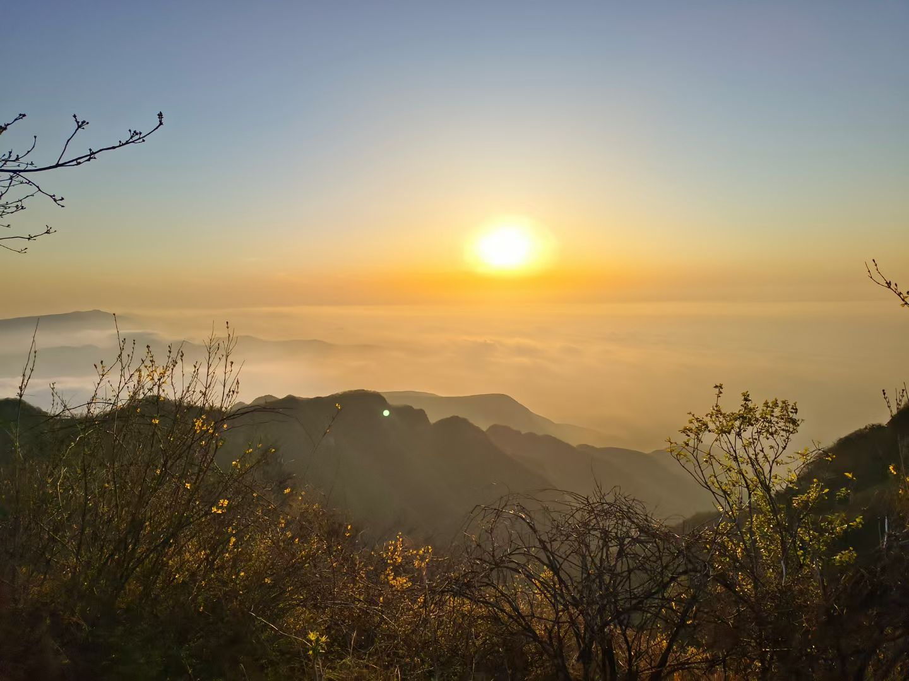
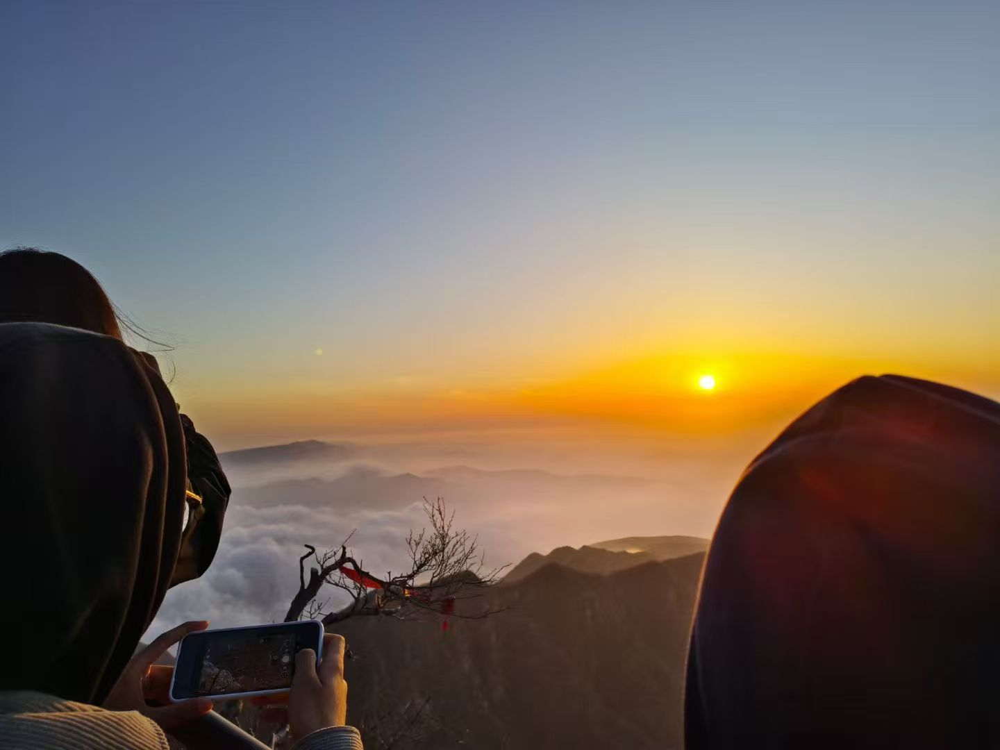

这是我目前仍然一直有微信往来的高中朋友

我们是高二认识的

当时坐在一起

好像是一个小组

慧慧是组里另一个男生叫他的

我听了以后也这么叫他

后来高三

超哥和慧慧是一个宿舍的

有一次超哥跟我说

他叫慧慧，慧慧不答应，不让他这么叫

说我可以叫他慧慧

说真的，很感动 就是有一个人认可你 也只认可了你

而另一个这么叫慧慧的男生 我不知道他们两个是否还有联系 

记得高中快毕业了

我因为一些事情吧

和某个男生有不好的关系

慧慧说，有人欺负我，他是无条件帮我的 

尽管后面没有发生什么

有些话 我仍然不会忘记

后来 应该是20年的那个寒假

他当时在练车 考驾照

没有吃饭

当时王嘉琪好像是因为好友的离开 让我也去

刚好都去县城

我就找了个超市 买了有点吃的 还有瓶微醺 (#^.^#)

见了慧慧 我让他看看篮子里我给他买的吃的

他见有瓶微醺 说这是在练车 不好吧 没喝呦 我们都是好孩子

聊了两句 我说一会还要找王嘉琪 

他吃的也没多少 也没再吃了

或许是他没什么胃口 或许是考虑的多了吧

之后联系就是大学了

当时是坐公交车来找我 后面去了哪 干了什么 我全然忘记了

临近大学毕业 我当时也是实习结束后了

我看他朋友圈发的爬山的照片

我说我也想去

他给我说 周五 一起 嵩山

是跟着团一起的

四月十二日 晚上 十一点半左右

因为入口查保险 我们都没有买

就顺着人多混进去

一路上吃了三根烤肠上去的 

说真的 我好久都不曾吃 也觉得我对它没什么兴趣

那次我真的觉得很好吃

爬到中间 有一个可以歇脚的地方

奥康慧慧和我 我是可能陌生人内向

奥康和旁边的几个大学生聊

后面还一起照了合照 身后就是明与暗交织的城市

到达山顶时 还早 

在玩了旁边的废弃房屋后

找了的地方坐着

夜晚的山上是很冷的

被冻了数个小时

值得情形是 这次是值得的

我看见了云海 是真的美

