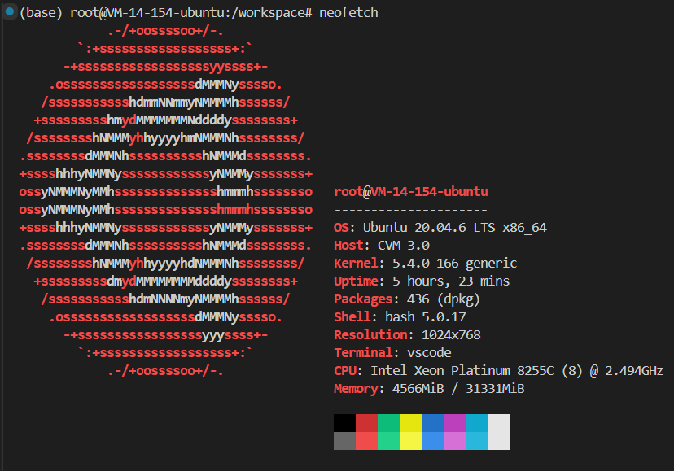
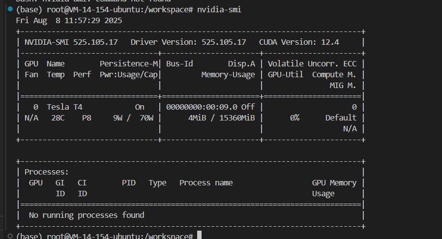

`apt install neofetch` 是一条在 **Debian / Ubuntu / 及其衍生发行版** 的 Linux 系统中用来**安装软件**的命令。

拆开解释：

1. **`apt`**

   * 这是 Ubuntu/Debian 系列系统的包管理工具（Advanced Package Tool）。
   * 用来安装、更新、卸载、搜索软件包。

2. **`install`**

   * `apt` 的一个子命令，意思是“安装”。
   * 格式：`apt install <软件名>`。

3. **`neofetch`**

   * 一个终端工具，用来**在命令行显示系统信息**，并配合漂亮的 ASCII 发行版 logo。
   * 它会显示操作系统版本、内核、CPU、内存、桌面环境等信息。
   * 常用于截图或炫酷的系统展示。

执行时流程：

```bash
apt install neofetch
```

系统会：

1. 从软件源里找到 `neofetch` 软件包。
2. 下载它和依赖文件。
3. 安装到系统中。

安装后运行：

```bash
neofetch
```

就能看到一个彩色的系统信息界面。

---

<details>
  <summary>点击展开 / 折叠：系统信息介绍</summary>

# 这张截图是什么（概述）

你贴出的图片是 **`neofetch`** 的输出 —— 一个用来在终端快速展示系统信息的工具。左边是发行版的 ASCII logo（这里是 Ubuntu 的标志），右侧按行列出了主机名、操作系统、内核、CPU、内存等关键信息，并在底部显示了终端颜色调色板。

下面我把每一行/每一项逐条拆开，详细解释含义、如何验证来源，以及常用的扩展命令与排查建议。

---

# 逐项详解

### 顶部：`root@VM-14-154-ubuntu`

* **含义**：当前登录用户和主机名。`root` 表示你以超级用户身份登录；`VM-14-154-ubuntu` 是主机名。
* **如何查**：

  ```bash
  whoami        # 当前用户名
  hostname      # 主机名
  ```

### `OS: Ubuntu 20.04.6 LTS x86_64`

* **含义**：操作系统及版本（Ubuntu 20.04.6 LTS），体系结构为 64 位（x86\_64）。
* **如何查**：

  ```bash
  cat /etc/os-release
  lsb_release -a
  ```

### `Host: CVM 3.0`

* **含义**：厂商/主机类型，`CVM` 常见于云厂商（Cloud Virtual Machine）表示这是云主机/虚拟机。具体厂商信息可不同云上显示不同标识。
* **如何查**：

  ```bash
  sudo dmidecode -s system-product-name   # 需 root，可能返回云厂商/型号
  hostnamectl
  ```

### `Kernel: 5.4.0-166-generic`

* **含义**：Linux 内核版本。
* **如何查**：

  ```bash
  uname -r
  uname -a
  ```

### `Uptime: 5 hours, 23 mins`

* **含义**：系统自上次启动以来运行时间（开机时长）。
* **如何查**：

  ```bash
  uptime
  ```

### `Packages: 436 (dpkg)`

* **含义**：系统已安装软件包数量（这里用的是 Debian/Ubuntu 的 `dpkg` 包管理器统计）。
* **如何查**：

  ```bash
  dpkg -l | wc -l
  # 或 apt:
  apt list --installed | wc -l
  ```

### `Shell: bash 5.0.17`

* **含义**：当前使用的 shell 及其版本。
* **如何查**：

  ```bash
  echo $SHELL
  bash --version
  ```

### `Resolution: 1024x768`

* **含义**：当前显示/终端的分辨率（对于远程/VSCode 终端通常是虚拟分辨率）。
* **如何查（图形环境）**：

  ```bash
  xdpyinfo | grep dimensions   # 需要 X 环境
  ```

### `Terminal: vscode`

* **含义**：neofetch 检测到你是在 **VS Code** 的集成终端里运行（通常是通过 Remote - SSH 打开的终端）。

### `CPU: Intel Xeon Platinum 8255C (8) @ 2.494GHz`

* **含义**：CPU 型号与频率。括号中的数字（`(8)`）表示 neofetch 检测到的核心数（可能是逻辑核心或物理核心，依系统而异）。
* **如何查看更详细信息**：

  ```bash
  lscpu
  cat /proc/cpuinfo | grep "model name" -m1
  ```

  `lscpu` 会显示 `CPU(s):`（逻辑核数）、`Core(s) per socket`、`Thread(s) per core` 等字段，帮助你区分物理核与线程。

### `Memory: 4566MiB / 31331MiB`

* **含义**：当前使用的内存 / 总内存，以 MiB（Mebibyte）为单位。
* **换算成 GiB（更直观）**：按 1 GiB = 1024 MiB 计算：

  * `4566 MiB ≈ 4.46 GiB`（计算：4566 ÷ 1024 = 4 + 470/1024 ≈ 4.459）
  * `31331 MiB ≈ 30.60 GiB`（计算：31331 ÷ 1024 = 30 + 611/1024 ≈ 30.596）
    所以约 **4.46 GiB / 30.60 GiB**（已用 / 总量）。
* **如何查**：

  ```bash
  free -h
  cat /proc/meminfo
  ```

### 底部：颜色块（16 色）

* **含义**：neofetch 显示当前终端的 16 色调色板（颜色 0–15）。用于检查主题/配色是否正确。

---

# 为什么 neofetch 有用

* **快速一览**：在终端打开时即可看到系统概况，方便截图或诊断（例如你发图给别人求助时）。
* **可配置**：可以自定义显示哪些信息、替换 ASCII logo、在登录时自动运行等。
* **轻量**：只读系统信息，不会改变任何设置。

---

# 常用扩展命令（排查/获取更多硬件信息）

* **查看显卡（如果有 NVIDIA）**：

  ```bash
  nvidia-smi
  lspci | grep -i nvidia
  ```
* **查看磁盘与分区**：

  ```bash
  df -h
  lsblk
  sudo fdisk -l
  ```
* **实时监控 CPU / 内存**：

  ```bash
  top
  htop    # 更友好（需安装: apt install htop）
  glances # 更全（需安装）
  ```
* **查看已安装包的详细来源**（Debian/Ubuntu）：

  ```bash
  dpkg -l | less
  ```

---

# 常见自定义与小技巧

* **安装 neofetch（Ubuntu/Debian）**：

  ```bash
  sudo apt update
  sudo apt install neofetch
  ```
* **登录时自动显示**：在 `~/.bashrc` 或 `~/.profile` 最后加一行：

  ```bash
  neofetch
  ```
* **配置文件位置**：`~/.config/neofetch/config.conf`（在此修改要显示/隐藏的字段、logo、格式等）。
* **让 neofetch 显示额外信息**：编辑 `config.conf` 中的 `info` 列表（例如加入 `gpu`、`disk` 等条目）。

---

# 小结 & 建议

* 你的机器是 **云主机（CVM）**，运行 **Ubuntu 20.04**，CPU 为 **Intel Xeon Platinum 8255C**，内存约 **31.3 GiB**（当前使用 \~4.5 GiB），并在 **VS Code 的终端** 中运行 neofetch。


</details>


在终端运行 nvidia-smi 会出现GPU信息界面



<details>
  <summary>点击展开 / 折叠：GPU状态信息</summary>

这张图显示的是在终端运行 `nvidia-smi` 的结果，意思是查看显卡（NVIDIA GPU）的状态信息。

---

### **第一行**

```
Fri Aug  8 11:57:29 2025
```

当前系统时间。

---

### **驱动和 CUDA 信息**

```
NVIDIA-SMI 525.105.17    Driver Version: 525.105.17    CUDA Version: 12.4
```

* **NVIDIA-SMI**：NVIDIA 的命令行工具版本（这里是 525.105.17）。
* **Driver Version**：显卡驱动版本（525.105.17）。
* **CUDA Version**：CUDA 工具包版本（12.4），用于 GPU 加速计算。

---

### **GPU 设备信息**

```
GPU  Name        Persistence-M    Bus-Id        Disp.A     Volatile Uncorr. ECC
Fan  Temp  Perf  Pwr:Usage/Cap    Memory-Usage  GPU-Util  Compute M.  MIG M.
```

对应下面这行数据：

```
0    Tesla T4    On              00000000:00:09.0  Off   0
N/A  28C   P8    9W / 70W        4MiB / 15360MiB   0%     Default     N/A
```

解释：

* **GPU**：编号，这台机器只有一张卡（`0`）。
* **Name**：显卡型号（Tesla T4，一种服务器用 GPU）。
* **Persistence-M**：`On` 表示持久化模式开启（节省初始化时间）。
* **Bus-Id**：PCI 总线 ID（唯一标识 GPU 位置）。
* **Disp.A**：显示器是否连接（Off 表示没接显示器）。
* **ECC**：错误纠正码功能，这里是 `0`（关闭）。

第二行：

* **Fan**：风扇转速（N/A，因为 T4 是被动散热）。
* **Temp**：温度（28°C）。
* **Perf**：性能状态（P8，空闲状态）。
* **Pwr\:Usage/Cap**：功耗（9W / 70W 最大）。
* **Memory-Usage**：显存使用（4 MiB / 15360 MiB，总共 15 GB）。
* **GPU-Util**：GPU 利用率（0%，空闲）。
* **Compute M.**：计算模式（Default，正常模式）。
* **MIG M.**：多实例 GPU 模式（N/A，未启用）。

---

### **进程信息**

```
No running processes found
```

说明当前没有程序在用这块 GPU。

---

💡 总结：

* 你这台服务器有一块 **Tesla T4** 显卡（15 GB 显存）。
* 驱动和 CUDA 都正常安装。
* GPU 当前几乎空闲（0% 利用率，4MiB 显存占用）。
* 没有进程在使用 GPU。


</details>
