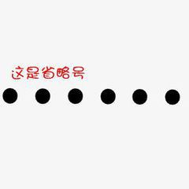

# 误闯天家!

细数18岁及过往岁月，我狂妄过，自信过，或有失意，亦或有悔过 ... 等等吧，就不一一细说

皆般过往，大多已如梦幻泡影，虚幻，不真实... 那些当时以为会烙印在脑海深处、足以与岁月同长的瞬间，也于时间消散。

如今能有所存续的，我都会陆续写入这本book里面，算是了却。

为什么标题是误闯天家呢，这就要说起我18岁直至今日的见闻

高考结束那年我刚好18岁

成绩对我来说也可以了，过了当时的一本线

自我觉得蛮幸运的

录取专业是数学 

当时觉得不过尔尔（PS:只是当时）

如今再看，这便是我的第一次**误闯天家**

第二次便是24年4月，人工智能的培训班

也是此次经历，让我**看到**了更多

